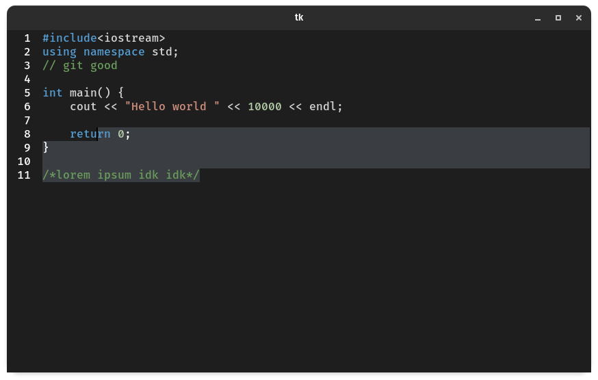

# Cupcake 🧁

[Docs](https://billyeatcookies.github.io/cupcake/pages/docs.html) |
[Gallery](https://billyeatcookies.github.io/cupcake/index.html) |
[Releases](https://github.com/billyeatcookies/cupcake/releases)

<!--
<table>
    <td>
        <a href=https://billyeatcookies.github.io/cupcake/pages/docs.html>Docs</a>
    </td>
    <td>
        <a href=https://billyeatcookies.github.io/cupcake/index.html>Documentation</a>
    </td>
    <td>
        <a href=https://github.com/billyeatcookies/cupcake/releases>Releases</a>
    </td>
</table> -->
Cupcake is the code editor that powers [Biscuit](https://github.com/billyeatcookies/Biscuit), written in pure python with the tkinter library. See a good list of the code editor's features [here](#features). It is licensed under the [MIT License](./LICENSE).

<table>
    <td>
        
    </td>
    <td>
        
    </td>
</table>

<!--  -->

## Features

- `🟢` Syntax Highlighting
- `🟢` Auto completions
- `🟢` Auto Indentation
- `🟢` Minimap
- `🟡` Extendable language support
- `🟡` Find Replace
- `🟡` Code Debugging
- `🟡` Language Detection
- `🔴` Code Folding

## Usage
- Clone the repository and copy src folder to your project
- import cupcake to your script.

### Example: Basic Code Editor

- Run `python examples/basic.py`
- Open your script to edit
- Start editing.
